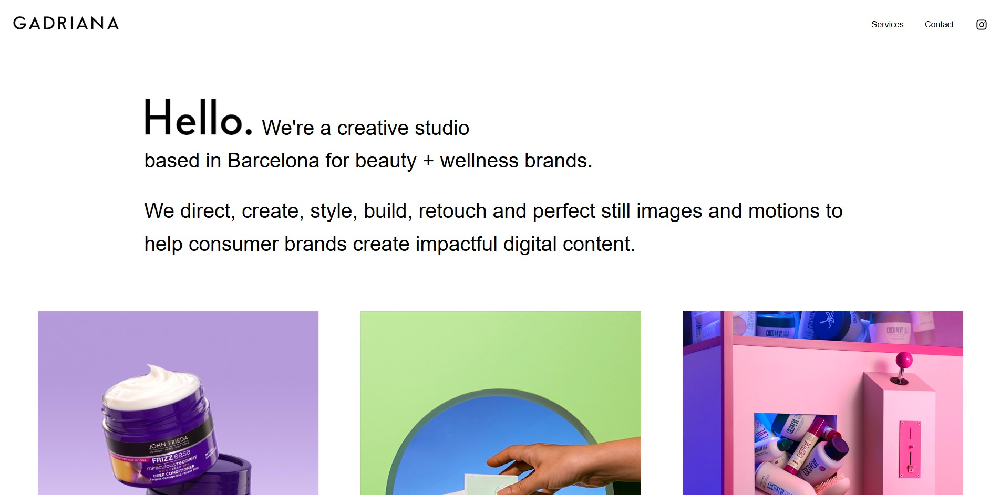

# Gadriana - Creative Studio website (Frontend)

A static, highly visual, and responsive portfolio website built for Gadriana, a Barcelona-based creative studio specializing in stunning photo and video content for international beauty and wellness brands.

This repository contains the client-side code. While currently static, we are working on integrating a backend solution to allow for dynamic content updates, meaning this site will not remain static for long!

## Project Goal

The primary objective was to create an elegant, intuitive, and high-performance digital showcase that allows Gadriana's beautiful work to take center stage. The design focuses on a "less is more" philosophy, ensuring a clean layout where every visual element is perfectly placed to attract potential international clients. A core focus was achieving flawless responsive design on all screen sizes.

### Key Features

- Visual-First Design: A simple, neat layout optimized to showcase high-quality photo and video content.
- Mobile-First Responsiveness: Flawless user experience across all screen sizes.
- Type Safety: Built with TypeScript for increased code reliability and maintainability.
- Contact Form: Functional contact form integrated using EmailJS.

## Tech stack

This project was built focusing on modern, efficient, and type-safe frontend technologies:
- React
- Typescript
- Tailwind Css
- Deployed with Netlify

##  Live Site

See the live result here: [gadriana.com](https://gadriana.com/) 

## What's Next?

Phase II development is underway to integrate a simple backend for independent client content management.

Feel free to explore the components and project structure.